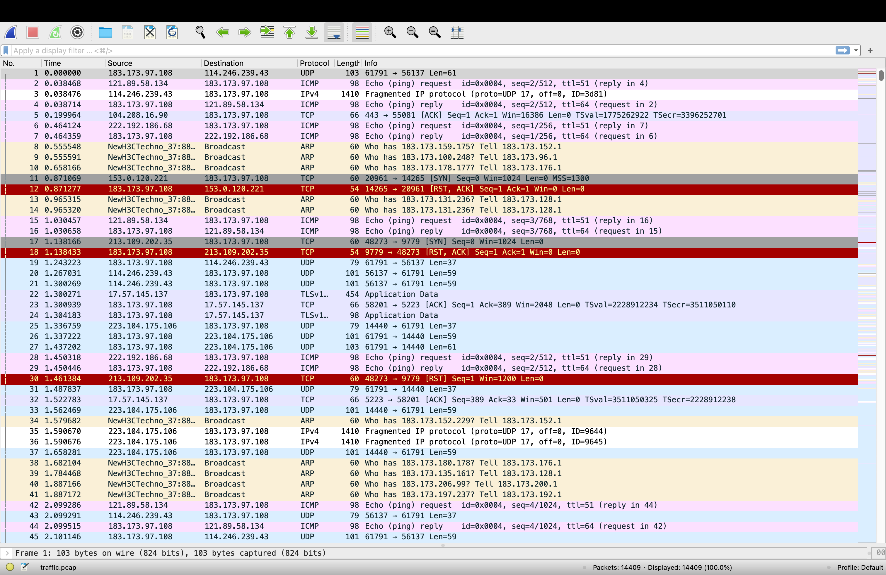
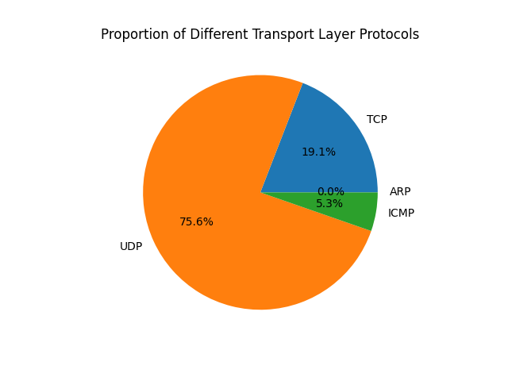
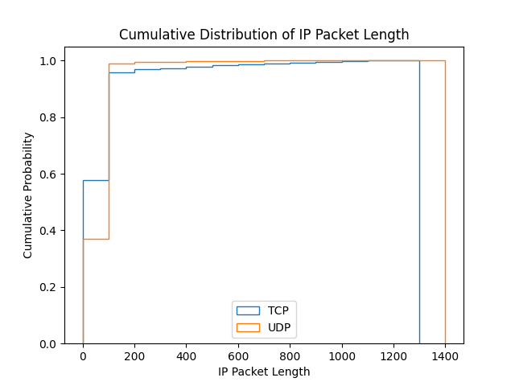

# Network Data Capture and Analysis

Name: 朱志杭  
Student ID: 2022012069  

## One screenshot of the captured web data



## Use tcpdump to capture the traffic on a physical network connected to my computer and save it to a file.

I use the order  

```bash
tcpdump -G 300 -w traffic-%Y%m%d%H%M%S.pcap
```

to capture the traffic on my computer(Mac). This will make a file named with the start time in every five minutes, all the packages captured in this five minutes will be saved in this file. When I want to analysis the packages, I will delete the time in its name.

## Description of my data processing methods and dataprocessing program.

I use python package scapy to process the packages I captured. Here I will describe how do I answer questions in procedure 2.  

1. In order to give the load proportion of different transport layer protocols carried by IP packets, I use following code to process. I find that in most case the following four protocols are used.  

   ```python
    # 1) Load proportion of different transport layer protocols
    transport_protocols = {'TCP': 0, 'UDP': 0, 'ICMP':0, 'ARP':0 }
    for packet in packets:
        if IP in packet:
            if TCP in packet:
                transport_protocols['TCP'] += 1
            elif UDP in packet:
                transport_protocols['UDP'] += 1
            elif ICMP in packet:
                transport_protocols['ICMP'] += 1
            elif NTP in packet:
                transport_protocols['ARP'] += 1

    import matplotlib.pyplot as plt
    plt.pie(transport_protocols.values(), labels=transport_protocols.keys(), autopct='%1.1f%%')
    plt.title('Proportion of Different Transport Layer Protocols')
    plt.show()
    ```

    This will check all the IP packets in the capture file and count the number of packages using TCP protocol and packages using UDP protocol. After that, I use matplotlib to draw a pie chart to show.

2. In the program, I check all the IP packages captured. If flags is 1 or frag is not 0 in the IP word in a package, this package is fragmented. I use following code to achieve this.

   ```python
    # 2) Identify fragmented IP packets
    fragmented_packets = []

    # Iterate through all packets
    for packet in packets:
        # Check if IP header exists
        if IP in packet:
            # Check if packet is fragmented
            if packet[IP].flags & 0x1:  # Check if the 'more fragments' flag is set
                fragmented_packets.append(packet)
            elif packet[IP].frag != 0:  # Check if fragment offset is non-zero, indicating fragmented packet
                fragmented_packets.append(packet)

    print("Number of fragmented IP packets:", len(fragmented_packets))
    ```

    After checking all packages, I will print the number of fragmented packages.

3. In the program, I use the folowing code to give the cumulative distribution curve of IP packet length. I first get all the packages using TCP(UDP) protocol and then use numpy to help draw the cumulative probability.

   ```python
   # 3) Cumulative distribution curve of IP packet length
    tcp_lengths = [len(packet) for packet in packets if IP in packet and TCP in packet]
    udp_lengths = [len(packet) for packet in packets if IP in packet and UDP in packet]

    # Plot cumulative distribution curve
    import numpy as np

    plt.hist(tcp_lengths, bins=np.arange(0, max(tcp_lengths), 100), cumulative=True, density=True, histtype='step', label='TCP')
    plt.hist(udp_lengths, bins=np.arange(0, max(udp_lengths), 100), cumulative=True, density=True, histtype='step', label='UDP')
    plt.xlabel('IP Packet Length')
    plt.ylabel('Cumulative Probability')
    plt.title('Cumulative Distribution of IP Packet Length')
    plt.legend()
    plt.show()
    ```

    After drawing the cumulative probability, I compare the difference under different loads. (TCP or UDP)

4. I find the broadcast packets using following codes. The destination of broadcast_packets is `ff:ff:ff:ff:ff:ff` and I checked all packages to find them.

    ```python
    # 4) Find broadcast packets
    broadcast_packets = [packet for packet in packets if Ether in packet and packet[Ether].dst == 'ff:ff:ff:ff:ff:ff']

    # Print number of broadcast packets
    print("Number of broadcast packets:", len(broadcast_packets))
    ```

5. I use the order  

```bash
tcpdump -w ipv6_traffic.pcap 'ip6' -G 300 -W 1
```

to capture ipv6 traffic.

## Process the data I've collected and try to answer questions.

I choose a file created by the order and change its name to traffic.pcap. Then run the order

```bash
python analysis.py
```

Here comes the result and my answer.

1. A pie chart to show the load proportion of different transport layer protocols carried by IP packets  
     
2. If flags is 1 or frag is not 0 in the IP word in a package, this package is fragmented.  

    ```bash
    Number of fragmented IP packets: 1939
    ```

    The result is that I captured 1939 fragmented packages.  
3. The cumulative distribution curve of IP packet length.  
     
4. The result is that I find 1406 broadcast packets.  

    ```bash
    Number of broadcast packets: 1406
    ```

    According to the cumulative distribution function, the maximum length of IP packets transmitted by TCP is smaller than the maximum length of IP packets transmitted by UDP. At the same time, there are significantly more packets with lengths less than 200 transmitted by TCP.
5. According to the file `ipv6_traffic.pcap`, the tcpdump filters successfully capture ipv6 traffic.  
   [ipv6_traffic.pcap](ipv6_traffic.pcap)
